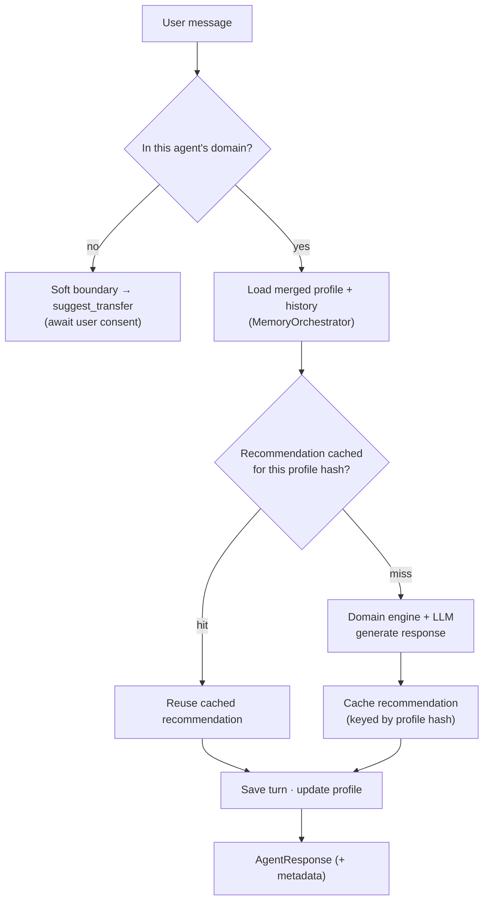
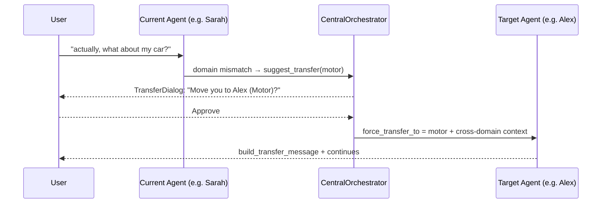

# AI_AGENTS.md — The Aegis AI Multi-Agent System

> A complete reference to every AI agent in Aegis AI: purpose, responsibilities,
> domain knowledge, workflow, inter-agent communication, transfer rules, memory
> model, and the roadmap for future agents.
>
> **See also:** [ARCHITECTURE.md](ARCHITECTURE.md) (system model) ·
> [CLAUDE.md](CLAUDE.md) (protection rules) · [API_REFERENCE.md](API_REFERENCE.md) ·
> [tests/eval/EVAL_REPORT.md](ai-python/tests/eval/EVAL_REPORT.md) (recommendation eval)

---

## 1. Philosophy

Aegis AI uses a **specialist multi-agent model**, not a single monolithic bot.
Each insurance domain is handled by a dedicated specialist that "thinks" only
about its domain, backed by an **Executive Manager** that governs, approves, and
routes. This mirrors how a real insurance firm works — specialists advise, a
manager oversees — and keeps each agent **focused, isolated, and auditable**.

Every agent serves the platform mission: **educate, guide, and protect** —
especially first-time buyers, seniors, rural users, and Tamil/Thanglish/English
speakers.

---

## 2. Agent Roster

### 2.1 Current (implemented)

| Agent | Domain | Module | Engine | Persona focus |
|---|---|---|---|---|
| **Executive Manager AI** | Governance / routing | `executive_ai.py` | Layer-5 approval | Oversight, approvals, escalation |
| **Sarah AI** | Health insurance | `sarah_ai.py` | `health_engine.py` | Empathetic family health advisor |
| **Alex AI** | Motor insurance | `alex_ai.py` | `motor_engine.py` | Precise vehicle-risk underwriter |
| **Emma AI** | Property / home | `emma_ai.py` | `property_engine.py` | Calm home-protection specialist |
| **Ethan AI** | Travel insurance | `ethan_ai.py` | `travel_engine.py` | Global-mobility travel expert |

### 2.2 Future (roadmap)

Knowledge AI · Claims AI · Renewal AI · Document Verification AI · Payment AI ·
Policy Management AI · Fraud Detection AI · Recommendation AI · Customer Success
AI · Voice Layer. See **§9**.

---

## 3. Shared Foundation — `BaseInsuranceAgent`

All specialists inherit from `BaseInsuranceAgent` (an abstract base class),
which guarantees consistent behaviour:

| Capability | Method | Purpose |
|---|---|---|
| Config injection | `set_env_config` | Receives the agent's JSON config at boot |
| Domain guarding | `check_domain_violation` | Detects out-of-domain requests |
| Soft boundaries | `_build_soft_boundary_message` | Politely redirects off-domain asks |
| Transfer handoff | `build_transfer_message` | Confirms a handoff **after** user approval |
| Profile access | `load_profile` / `update_profile` | Merged shared + domain profile |
| Recommendation cache | `_get_cached_recommendation` / `_cache_recommendation` | Reuse results for an unchanged profile |
| Memory namespace | `_memory_key` | Isolated key `{domain}_{customer_id}` |

Every agent returns a structured **`AgentResponse`** (reply text + metadata such
as domain, transfer flags, session id), normalised by the orchestrator.

---

## 4. Agent Profiles

### 4.1 Executive Manager AI
- **Purpose:** the "manager" over all specialists — governance, approval, and
  routing of complex or cross-cutting requests.
- **Responsibilities:** approve/return recommendations (Layer-5
  `approval_engine`), executive analytics, handle escalations, intercept
  governance-class intents (`_executive_route_intercept`).
- **Knowledge:** Layer-1 `executive-ai/` (policies, compliance, escalation
  matrix, organisation structure) + Layer-5 executive memory.
- **Communicates with:** every specialist (approvals, oversight).
- **Memory:** executive memory (Layer 5), separate from customer domain memory.

### 4.2 Sarah AI — Health
- **Purpose:** guide families to the right health cover, in plain language.
- **Responsibilities:** intake (who is covered, ages, budget), plan match,
  premium explanation, cashless/network guidance, waiting-period clarity.
- **Knowledge:** Layer-1 `health/` (plans, FAQs, rules) + `health_plans.py`.
- **Engine:** `health_engine.py` (scoring + plan selection).
- **Tone:** empathetic, reassuring; ideal for first-time and senior buyers.

### 4.3 Alex AI — Motor
- **Purpose:** protect vehicles with accurate, risk-based cover.
- **Responsibilities:** vehicle intake (make/model/year → IDV), OD vs
  third-party, zero-dep and add-ons, premium breakdown.
- **Knowledge:** Layer-1 `motor/` + `motor_plans.py`.
- **Engine:** `motor_engine.py`.
- **Tone:** precise, underwriter-like, confidence-building.

### 4.4 Emma AI — Property / Home
- **Purpose:** protect homes and contents against fire, theft, and calamity.
- **Responsibilities:** own vs rent, structure vs contents, calamity cover,
  sum-insured guidance.
- **Knowledge:** Layer-1 `home-property/` + `property_plans.py`.
- **Engine:** `property_engine.py`.
- **Tone:** calm, protective, detail-oriented.

### 4.5 Ethan AI — Travel
- **Purpose:** secure journeys with medical, cancellation, and baggage cover.
- **Responsibilities:** destination/date intake, medical evacuation, trip
  cancellation, adventure/baggage add-ons.
- **Knowledge:** Layer-1 `travel/` + `travel_plans.py`.
- **Engine:** `travel_engine.py`.
- **Tone:** energetic, globally-aware, practical.

---

## 5. Agent Workflow (per turn)

---

## 6. Inter-Agent Communication & Transfer Rules

The orchestrator — not the agents — mediates all routing. See
[ARCHITECTURE.md §4](ARCHITECTURE.md) for the dispatch sequence.

### 6.1 Consent-Based Transfer

**Rules**
1. **Never auto-switch.** A mismatch yields `suggest_transfer`, awaiting user
   approval in the UI.
2. **Context travels.** On approval, `MemoryOrchestrator.export_for_transfer`
   passes a bounded conversation summary to the incoming agent.
3. **Interrupts are recoverable.** If a user changes topic mid-workflow,
   `InterruptDetector` fires and the workflow is snapshotted
   (`workflow_snapshot`) for later resume.
4. **Executive intercept.** Governance/approval-class intents route to Executive
   Manager AI regardless of the active specialist.
5. **Domain isolation.** An agent never reads another domain's memory directly.

---

## 7. Memory Model per Agent

| Scope | Store | Key |
|---|---|---|
| Conversation history | `conversation_store` | `{domain}_{customer_id}` |
| Domain profile | `profile_manager` | `{domain}_{customer_id}` |
| Shared profile | `profile_manager` | `shared_{customer_id}` |
| Recommendation cache | `recommendation_cache` | `{domain}_{customer_id}` + profile hash |

- Agents see a **merged** view (shared + domain) but write within their own
  namespace.
- The **shared** profile carries cross-domain facts (e.g. family size) so a
  transfer feels continuous without leaking domain-specific detail.

**Durability & coherence.** The Layer-3 file stores are written **atomically**
(temp file → `fsync` → `os.replace`) under a cross-process **advisory file
lock**, so a reader never sees a torn file and a crash never corrupts a profile.
Read caches are **mtime/size-aware** and saves are **disk-authoritative merges**,
so concurrent workers do not lose each other's updates. This is described in
detail in the memory hardening notes (§11). The `memory_engine` (Layer-3, in the
`Aegis-AI/` tree) still owns its own storage, so the AI engine runs with
`WEB_CONCURRENCY=1` until that path is made process-safe too.

---

## 8. Intent & Interrupt Intelligence

- **`IntentDetectionEngine`** scores the message across domains, detects direct
  agent mentions (highest confidence), and recognises pure continuations so it
  doesn't needlessly re-route an ongoing conversation.
- **`FastIntentRouter` + `IntentCache`** provide a cheap first pass and memoise
  results to keep latency and LLM cost low.
- **`InterruptDetector`** distinguishes a genuine topic change from a
  clarification, protecting in-progress workflows.

---

## 9. Future Agents (Roadmap)

| Agent | Purpose | Integrates with |
|---|---|---|
| **Knowledge AI** | Deep insurance education & Q&A for novices | Layer-1, hybrid_search |
| **Claims AI** | Guide and triage claims end-to-end | Policy Mgmt, Fraud Detection |
| **Renewal AI** | Proactive renewals & lapse prevention | Policy Mgmt, Payment |
| **Document Verification AI** | KYC / document authenticity | Payment, Claims |
| **Payment AI** | Secure premium collection & receipts | Policy Mgmt, backend |
| **Policy Management AI** | Lifecycle: issue, endorse, cancel | All post-sale agents |
| **Fraud Detection AI** | Risk & anomaly detection | Claims, Executive |
| **Recommendation AI** | Cross-domain, portfolio-level advice | All specialists |
| **Customer Success AI** | Retention, education, satisfaction | Renewal, Knowledge |
| **Voice Layer** | First-class multilingual voice (Tamil/Thanglish) | Streaming layer, all agents |

### Expansion Principles
- Every new agent inherits `BaseInsuranceAgent` and registers via
  `EnvironmentRegistry` — it does **not** bypass `CentralOrchestrator`.
- New agents get an **isolated memory namespace** and their own Layer-1 knowledge.
- Transfers to/from new agents follow the **same consent-based rules** (§6).
- Post-sale agents (Claims, Renewal, Payment) coordinate through Policy
  Management AI as the system of record.

---

## 10. Adding a New Agent — Checklist

1. Create `app/agents/<name>_ai.py` extending `BaseInsuranceAgent`.
2. Add domain knowledge under `Aegis-AI/layer1/insurance-data/<domain>/`.
3. Add an engine + plans module if the domain scores/prices plans.
4. Register the environment in `EnvironmentRegistry` with config
   (`cache_ttl`, `max_history`, agent name).
5. Extend intent scoring so `IntentDetectionEngine` can route to it.
6. Define transfer relationships (who hands off to/from it).
7. Add tests and update **this file** + [ARCHITECTURE.md](ARCHITECTURE.md).

> No agent ships without isolation, consent-based transfer, tenant-scoped
> memory, and documentation. These are enforced by [CLAUDE.md](CLAUDE.md).

---

## 11. Evaluation, Observability & Memory Hardening

Quality and reliability work that surrounds — but does not alter — the protected
agent logic.

### 11.1 Recommendation evaluation (safety net)

A deterministic, **LLM-free** harness (`ai-python/tests/eval/`) drives all four
specialist engines across **13 mission-aligned personas** and asserts the
invariants of a trustworthy recommendation (stable envelope, bounded scores,
honest ranking, determinism, an advisory narrative on every plan, no profile
mutation, and budget→segment monotonicity). Two golden baselines pin behaviour:
`recommendations.json` (each persona's segment + recommended plan + scores) and
`prompts.json` (the exact rendered system prompt for ordinary / Tamil / empty /
poisoned-legacy profiles, guarding the injection-critical renderer). Full details
and the current baseline table are in
[tests/eval/EVAL_REPORT.md](ai-python/tests/eval/EVAL_REPORT.md).

### 11.2 Reasoning observability

The non-streaming reasoning path is instrumented with Prometheus metrics, exposed
on the AI engine's `/metrics`:

| Metric | Meaning |
|---|---|
| `aegis_ai_dispatch_seconds` | Orchestrator dispatch latency (labels: domain, outcome) |
| `aegis_ai_llm_call_seconds` | Per-call LLM latency (labels: provider, outcome) |
| `aegis_ai_llm_tokens_total` | Prompt/completion tokens (labels: provider, kind) |

Recording is observation-only and defensive — a metrics failure never breaks a
reply. The protected SSE/voice streaming path is intentionally **not** instrumented
pending sign-off.

### 11.3 Memory durability & multi-worker safety

The Layer-3 file stores were made crash-safe and cross-process-safe:

- **Atomic writes** — temp file → `fsync` → `os.replace`; a reader always sees a
  complete file, even across a crash.
- **Advisory file locks** — an `fcntl` lock on a sidecar `.lock` file serialises
  each read-modify-write across uvicorn workers.
- **mtime/size-aware caches** — a cached value is reused only while the file's
  `(mtime, size)` signature is unchanged, so one worker sees another's write.
- **Disk-authoritative merge-on-save** — a save folds its update into the latest
  on-disk state (with list fields unioned), so concurrent updates to different
  fields both survive.

The `memory_engine` (Layer-3, `Aegis-AI/` tree) path is the remaining follow-up
before `WEB_CONCURRENCY` can be raised above 1.
