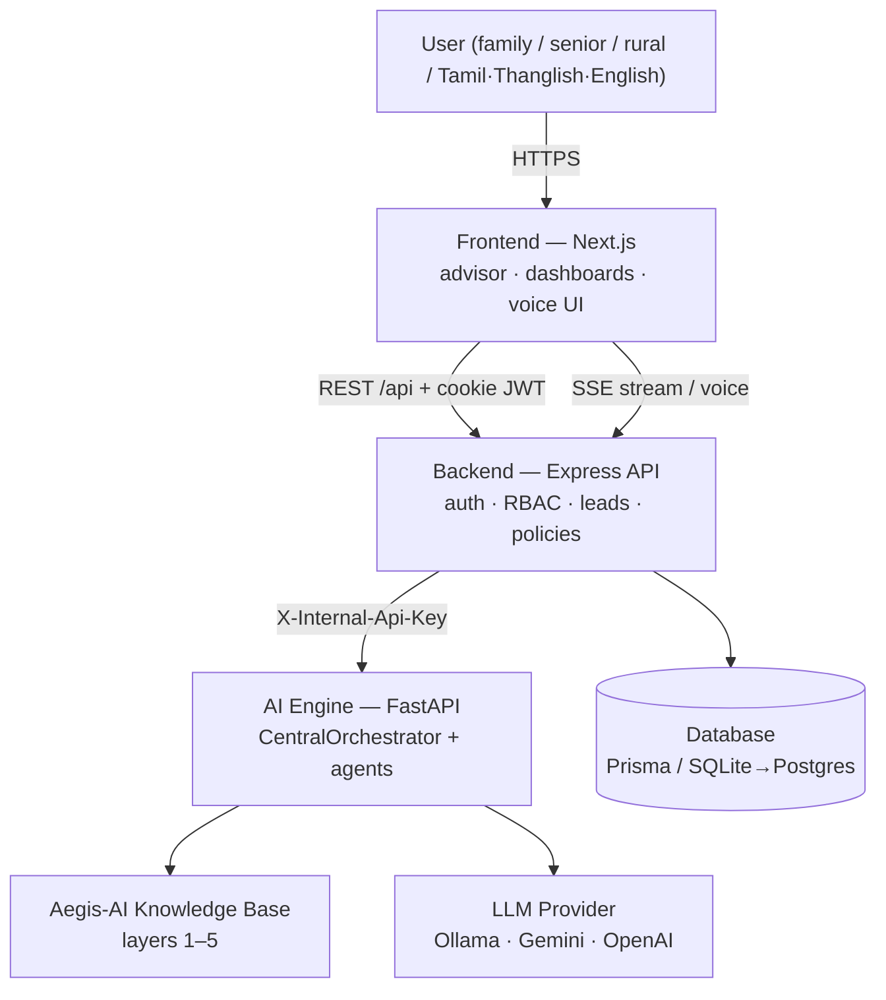
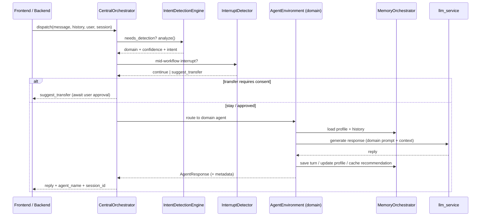
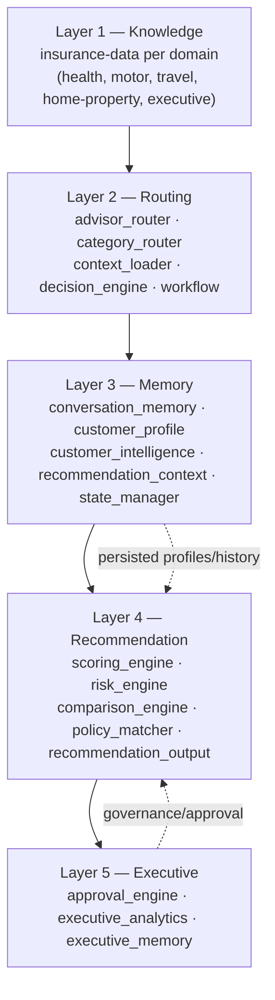
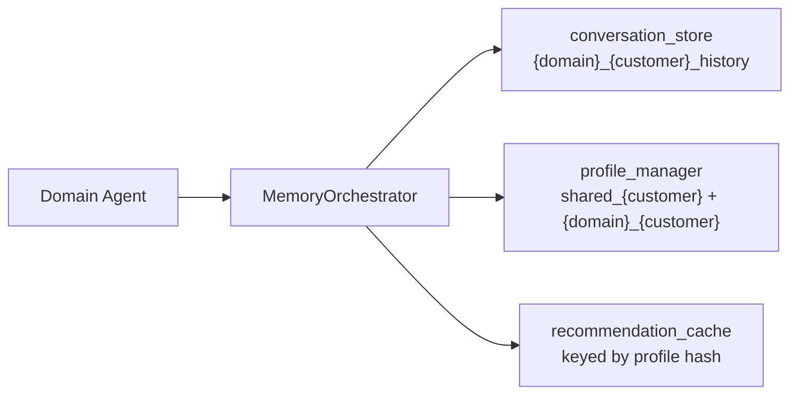
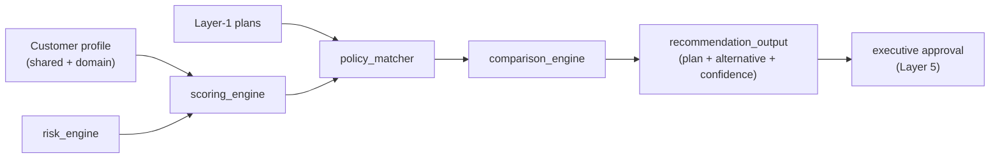
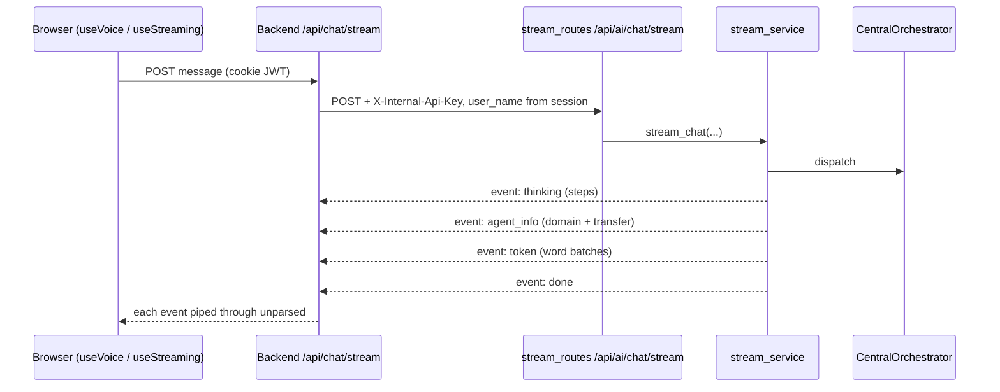
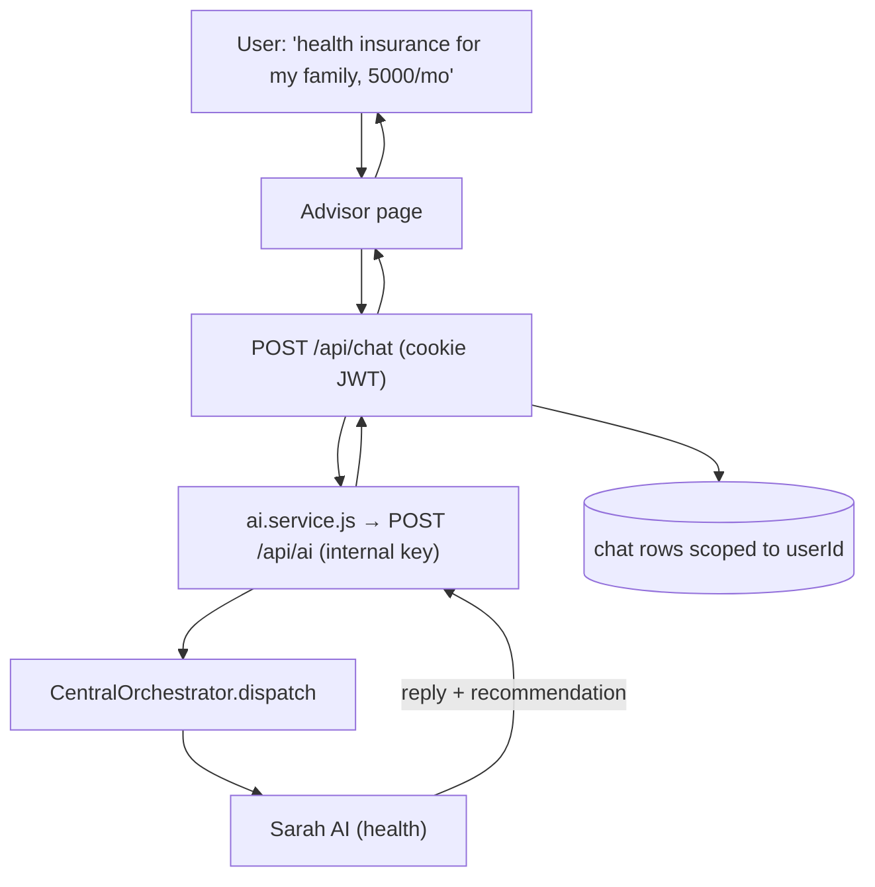
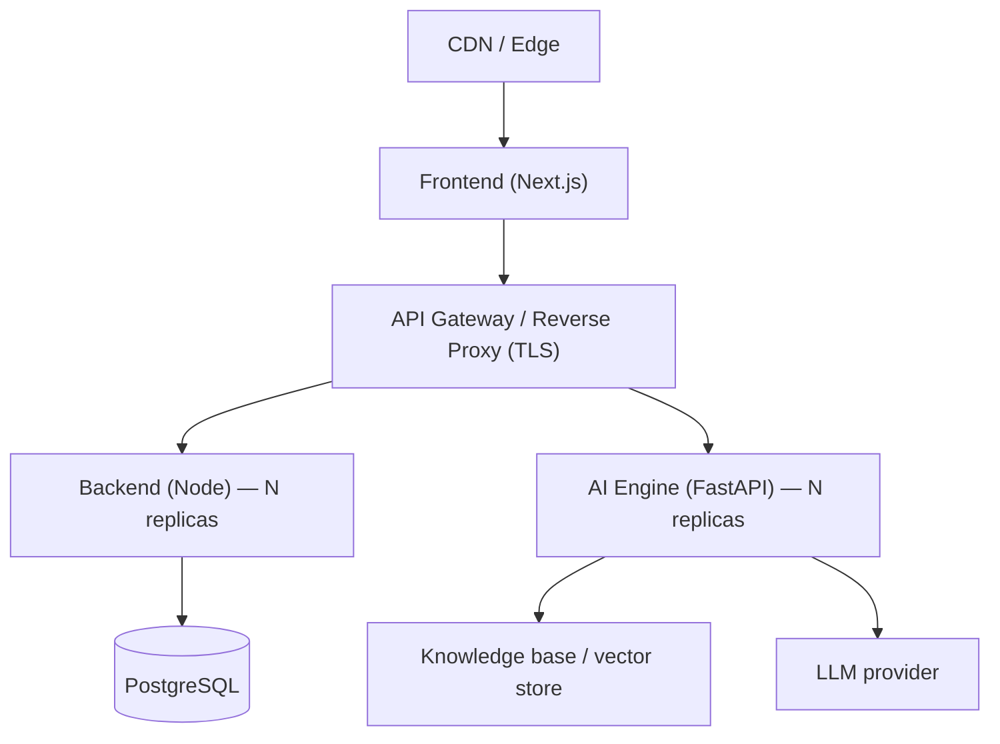

# ARCHITECTURE.md — Aegis AI Platform Architecture

> The authoritative technical description of the Aegis AI system: its services,
> the multi-agent AI engine, the layered reasoning knowledge base, data flows,
> and cross-cutting concerns.
>
> **See also:** [AI_AGENTS.md](AI_AGENTS.md) (agent detail) ·
> [DATABASE.md](DATABASE.md) · [API_REFERENCE.md](API_REFERENCE.md) ·
> [SECURITY.md](SECURITY.md) · [CLAUDE.md](CLAUDE.md)

---

## 1. System Overview

Aegis AI is a **mono-repository** composed of four cooperating components plus a
layered knowledge base:

| Component | Runtime | Role |
|---|---|---|
| `frontend/` | Next.js / React / TS | Consumer & admin experience, advisor chat, voice UI |
| `backend/` | Node.js / Express / Prisma | Auth, RBAC, leads, policies, chat bridge, realtime |
| `ai-python/` | FastAPI / Python 3.13 | Multi-agent AI engine ("the brain") |
| `Aegis-AI/` | Data + rules (layers 1–5) | Knowledge, routing, memory, recommendation, executive governance |
| Database | SQLite → PostgreSQL | Users, companies, leads, policies, chats, documents |

### 1.1 High-Level Topology



**Every path to the AI engine is server-to-server**, authenticated with the
internal service key. The browser never addresses the engine.
1. **Request/response** — Backend → AI (`POST /api/ai`) for standard chat.
2. **Streaming / voice** — Browser → Backend (`POST /api/chat/stream`) → AI
   (`POST /api/ai/chat/stream`). The backend authenticates the customer, applies
   `aiLimiter`, and pipes the SSE stream back unparsed, so the path keeps its
   token-by-token latency.

The proxy is not a routing preference. The engine resolves the `user_name` it is
given straight to that customer's profile and conversation memory, so a browser
allowed to address it directly could name any customer and read and write their
data. See [SECURITY.md §1](SECURITY.md).

---

## 2. Frontend Architecture

**Stack:** Next.js App Router, React, TypeScript, Tailwind CSS.

```
frontend/src/
├── app/                    # Route segments
│   ├── login/              # Consumer login portal
│   ├── admin-login/        # Administrator portal (admin-only gate)
│   ├── consumer-dashboard/ # Customer home
│   ├── admin-dashboard/    # Admin home (guarded)
│   ├── admin/{users,products,analytics,ai-monitoring}/
│   ├── advisor/            # Multi-agent chat + voice experience
│   ├── policies/           # Product browsing & details
│   └── purchase/           # KYC → OTP → payment → policy issue flow
├── components/             # ChatMessage, AIChatMessage, VoiceEngine, ThinkingEngine,
│                           #   TransferDialog, InterruptDialog, EnvironmentBadge …
├── context/                # AuthContext, PurchaseContext, ThemeContext
├── hooks/                  # useStreaming (SSE), useVoice
└── services/               # api.ts (axios client, httpOnly-cookie aware)
```

**Key principles**
- Auth token lives in an **httpOnly cookie**; the client never reads it. Session
  is resolved via `GET /api/auth/me`.
- Role-based redirection is centralised in `AuthContext.login()`.
- Streaming/voice consume Server-Sent Events via `useStreaming` / `useVoice`.
- All HTTP goes through `services/api.ts` (`withCredentials: true`).

---

## 3. Backend Architecture (Node.js)

**Pattern:** `route → validate → controller → service → Prisma`, with global
security middleware and centralised error handling.

```
backend/src/
├── app.js                  # Middleware chain (helmet, CORS, rate limit, routers)
├── server.js               # HTTP + Socket.io bootstrap, graceful shutdown
├── config/                 # env (fail-fast validation), security (CORS+limiters), db
├── middleware/             # auth (protect/restrictTo), validate, error
├── routes/                 # auth, leads, policies, chat, upload, company, admin, ui_action
├── controllers/            # request handlers
├── services/ai.service.js  # Bridge to the Python AI engine (+ resilient fallback)
├── sockets/index.js        # JWT-authenticated realtime chat
├── validations/schemas.js  # Hand-rolled body validators
└── utils/                  # appError, catchAsync, cookies
```

### 3.1 Request Middleware Chain

```mermaid
graph LR
    R["Incoming /api request"] --> H["helmet\n(HSTS, CORP, referrer)"]
    H --> C["CORS allowlist\n(no wildcard + credentials)"]
    C --> P["body parsers\n(10kb limit)"]
    P --> RL["rate limiter\n(api / auth / ai)"]
    RL --> RT["route"]
    RT --> V["validateBody"]
    V --> AUTH["protect + restrictTo"]
    AUTH --> CTRL["controller → service"]
    CTRL --> ERR["global error handler"]
```



### 3.2 Backend ⇄ AI Bridge

`services/ai.service.js` fetches **user-scoped** recent history, forwards the
message to `POST /api/ai` with the internal key, and returns agent metadata
(`agent_name`, `transferred`, `session_id`). If the AI engine is offline, a
**resilient fallback** produces a domain-aware reply so the product never
hard-fails.

---

## 4. AI Engine Architecture (Python / FastAPI)

The AI engine is a **multi-agent system** coordinated by a central orchestrator.
Each insurance domain runs as an **isolated environment** with its own agent,
configuration, and memory namespace.

### 4.1 Module Map

```
ai-python/app/
├── orchestrator/
│   ├── central_orchestrator.py   # dispatch(), transfers, interrupts, executive intercept
│   ├── environment_registry.py   # boots & holds the 5 domain environments
│   ├── fast_intent_router.py     # cheap first-pass routing
│   ├── intent_cache.py           # memoised intent results
│   ├── interrupt_detector.py     # mid-workflow topic-change detection
│   ├── session_manager.py        # per-session active-agent state
│   └── workflow_snapshot.py      # save/restore in-progress workflows
├── intent/intent_engine.py       # IntentDetectionEngine (domain scoring)
├── agents/
│   ├── base_agent.py             # BaseInsuranceAgent (ABC) + AgentResponse
│   ├── sarah_ai.py  alex_ai.py  emma_ai.py  ethan_ai.py  executive_ai.py
│   ├── agent_environment.py      # wraps an agent + its config + caches
│   └── {health,motor,property,travel}_engine.py / _plans.py
├── memory/
│   ├── memory_orchestrator.py    # unified memory API for agents
│   ├── conversation_store.py     # per-(customer,domain) turn history
│   ├── profile_manager.py        # shared + domain customer profiles
│   └── recommendation_cache.py   # rec results keyed by profile hash
├── services/
│   ├── chat_service.py           # dispatch facade used by routes
│   ├── stream_service.py         # SSE token streaming (voice path)
│   ├── ui_action_engine.py       # structured button actions (bypass chat)
│   ├── llm_service.py            # provider-agnostic LLM (ollama/gemini/openai)
│   └── hybrid_search.py          # knowledge retrieval
├── routes/                       # chat, stream, action, health
├── middleware/internal_auth.py   # X-Internal-Api-Key gate
└── models/schemas.py             # Pydantic request/response models
```

### 4.2 Dispatch Flow (single message)



### 4.3 Agent Communication & Transfer Rules

- **Isolation:** each agent's memory key is `{domain}_{customer_id}`; agents
  cannot read another domain's memory directly.
- **Consent-based transfer:** a domain mismatch produces a `suggest_transfer`
  (not an automatic switch). The user approves in the UI (`TransferDialog`),
  then the next call carries `force_transfer_to`.
- **Interrupts:** if a user changes topic mid-workflow, `InterruptDetector`
  raises an interrupt; the in-progress workflow is snapshotted
  (`workflow_snapshot`) so it can be resumed after the detour.
- **Cross-domain context:** on transfer, `MemoryOrchestrator.export_for_transfer`
  hands the incoming agent a bounded summary of the prior conversation.
- **Executive intercept:** `_executive_route_intercept` routes
  governance/approval-class requests to **Executive Manager AI**.

Full per-agent detail is in **[AI_AGENTS.md](AI_AGENTS.md)**.

---

## 5. Aegis-AI Knowledge & Reasoning Layers

`Aegis-AI/` is a **rule-driven, data-backed reasoning system** organised into
five layers. The Python agents read from and write to these layers.



| Layer | Responsibility | Consumed by |
|---|---|---|
| **1 — Knowledge** | Domain facts, plans, FAQs, rules | Agents, hybrid_search |
| **2 — Routing** | Category & advisor routing, decision logic | Orchestrator |
| **3 — Memory** | Conversations, profiles, intelligence, rec-context | MemoryOrchestrator |
| **4 — Recommendation** | Scoring, risk, comparison, matching | Domain engines |
| **5 — Executive** | Approval, analytics, executive memory | Executive AI |

---

## 6. Memory Architecture

Memory is **file-backed** under `Aegis-AI/layer3/` and mediated by
`MemoryOrchestrator`, giving agents one clean API:



- **Two-tier profiles:** a **shared** cross-domain profile plus a **per-domain**
  profile, merged at read time (`load_profile`).
- **Turn persistence:** `save_turn` records a user+assistant pair after a
  successful response.
- **Recommendation cache:** results are cached against a **profile hash** and
  invalidated automatically when the profile changes — avoiding repeated paid
  LLM/scoring work for an unchanged customer.
- **Tenant isolation:** memory keys are namespaced per customer and per domain.

---

## 7. Recommendation Engine

Recommendation is produced by **domain engines** (`health_engine`,
`motor_engine`, `property_engine`, `travel_engine`) using Layer-4 scoring and
Layer-1 plan data, then optionally governed by Layer-5 executive approval.



Output is a structured recommendation (primary plan, alternative plan,
confidence score, executive approval) that the frontend renders as comparison
cards. Premium math lives in `utils/premium_calculator.py`.

---

## 8. Voice & Streaming Layer

The voice experience is built on **Server-Sent Events**, not request/response:



Event types: `thinking`, `agent_info`, `token`, `done`, `error`. The backend is a
transport on this path: it pipes the SSE framing through without parsing it, a
customer closing the tab aborts the upstream call rather than leaving it billing,
and upstream failures arrive in-band as an `error` event (the SSE headers are
already sent by then). **This path is protected — do not alter without
sign-off.**

---

## 9. Data & API Flow (end-to-end example)



Full endpoint contracts are in **[API_REFERENCE.md](API_REFERENCE.md)**.

---

## 10. Security Layer (cross-cutting)

Summarised here; full policy in **[SECURITY.md](SECURITY.md)**.

| Concern | Mechanism |
|---|---|
| AuthN | JWT in httpOnly cookie; Bearer fallback |
| AuthZ | `restrictTo(role)`; public signup fixed to `customer` |
| Service isolation | `X-Internal-Api-Key` (constant-time, fail-closed in prod) |
| Transport | Helmet (HSTS/CORP/referrer), strict CORS allowlist |
| Abuse control | `api`/`auth`/`ai` rate limiters + per-socket throttle |
| Input safety | Node validators + Pydantic `max_length` bounds |
| Tenant isolation | All user-data queries scoped by `userId` |
| Error hygiene | Generic client errors in prod; detail logged server-side |

**Known hardening backlog:** front the SSE stream endpoint with a gateway;
add `ownerId` scoping to uploads; add CSRF protection for cookie flows. Tracked
in SECURITY.md.

---

## 11. Deployment Topology (target)



Deployment procedures, environment matrices, and rollback are in
**[DEPLOYMENT.md](DEPLOYMENT.md)**.

---

## 12. Architectural Invariants (do not break)

1. Agents are **isolated**; cross-domain data only via `MemoryOrchestrator`.
2. Transfers are **user-consented**; never auto-switch domains.
3. The **orchestrator** is the only router into agents.
4. The **SSE/voice** path is load-bearing for the voice product.
5. All user-data access is **tenant-scoped**.
6. The AI engine is **provider-agnostic** via `llm_service`.

These invariants are enforced by review and by the rules in
**[CLAUDE.md](CLAUDE.md)** and **[PROJECT_RULES.md](PROJECT_RULES.md)**.
