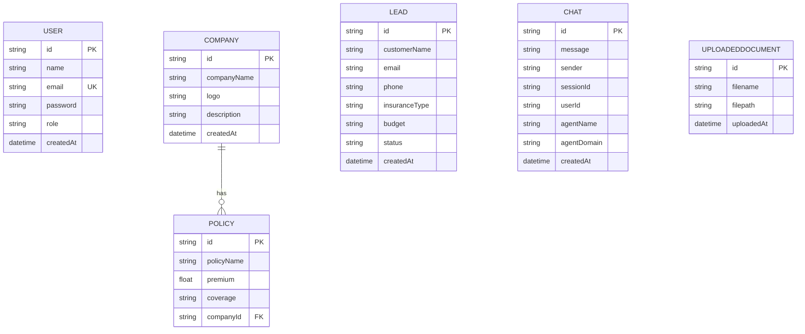

# DATABASE.md — Data Model & Persistence

> The authoritative reference for Aegis AI's relational data: models,
> relationships, indexes, migrations, performance, and the scaling path from
> SQLite (development) to PostgreSQL (production).
>
> **See also:** [ARCHITECTURE.md](ARCHITECTURE.md) ·
> [API_REFERENCE.md](API_REFERENCE.md) · [SECURITY.md](SECURITY.md)

Aegis AI has **two persistence systems**:
1. **Relational DB** (Prisma) — users, companies, leads, policies, chats,
   documents. *This document.*
2. **File-backed AI memory** (`Aegis-AI/layer3/`) — conversation history and
   customer profiles managed by `MemoryOrchestrator`. See
   [ARCHITECTURE.md §6](ARCHITECTURE.md).

---

## 1. Engine & Access

| Aspect | Development | Production (target) |
|---|---|---|
| Engine | SQLite (`file:./dev.db`) | PostgreSQL |
| ORM | Prisma Client | Prisma Client |
| IDs | `uuid` (string) | `uuid` |
| Access | **Prisma only** — no raw SQL | Prisma only |

All data access goes through Prisma (`backend/src/config/db.js`). Schema lives in
`backend/prisma/schema.prisma`; seed logic in `prisma/seed.js`.

---

## 2. Entity-Relationship Model



**Enforced relationship:** `Company (1) → (N) Policy` with
`onDelete: Cascade` — deleting a company removes its policies.

**Logical (not yet FK-enforced) links:** `Chat.userId → User.id` and
`Chat.sessionId` group a conversation. These are stored as nullable strings
today; promoting them to real relations is a scaling recommendation (§7).

---

## 3. Models in Detail

### 3.1 User
| Field | Type | Notes |
|---|---|---|
| `id` | uuid PK | |
| `name` | string | required |
| `email` | string **unique** | login identifier |
| `password` | string | **bcrypt-12 hash** — never plaintext |
| `role` | string | `customer` \| `admin` \| `superadmin`; default `customer` |
| `createdAt` | datetime | default now |

Security-critical: public registration forces `role = customer`
(see [SECURITY.md §3](SECURITY.md)).

### 3.2 Company → Policy
- `Company` holds branding + a `Policy[]` collection.
- `Policy` has `premium` (Float), `coverage`, and a cascading FK to `Company`.

### 3.3 Lead
Prospect capture (name, email, phone, `insuranceType`, `budget`, `status`
default `pending`). Managed by admins/superadmins.

### 3.4 Chat
Conversation log. `sender` distinguishes `customer` vs `advisor`; `userId`
scopes ownership; `sessionId` groups a session; `agentName`/`agentDomain`
capture which specialist replied.

> **Tenant isolation:** all reads of `Chat` filter by `userId`
> (see [SECURITY.md §8](SECURITY.md)).

### 3.5 UploadedDocument
File metadata (`filename`, `filepath`, `uploadedAt`). **Known gap:** no
`ownerId` yet — tracked as an IDOR fix in [SECURITY.md §12](SECURITY.md).

---

## 4. Indexes

| Model | Index | Type | Status |
|---|---|---|---|
| User | `email` | unique | ✅ present |
| Company | `id` | primary | ✅ |
| Policy | `companyId` | FK | ✅ (relation) |
| Chat | `userId`, `sessionId` | secondary | ⚠️ recommended (§7) |
| Lead | `status`, `createdAt` | secondary | ⚠️ recommended (§7) |

**Recommendation:** add composite indexes on `Chat(userId, createdAt)` and
`Chat(sessionId, createdAt)` — history is always read filtered by owner/session
and ordered by time — and on `Lead(status, createdAt)` for admin listing.

---

## 5. Migrations

- **Dev workflow:** `npm run db:push` (`prisma db push`) syncs the schema to
  SQLite; `prisma/seed.js` seeds companies/policies.
- **Prod workflow (target):** switch to versioned `prisma migrate` migrations
  under source control so schema changes are auditable and reversible.
- **Rule:** every schema change updates this document and includes a migration;
  never hand-edit the database.

```bash
# Development
npm run db:push          # apply schema.prisma to dev.db
node prisma/seed.js      # seed reference data
npm run db:studio        # inspect data (Prisma Studio)

# Production (target)
npx prisma migrate deploy
```

---

## 6. Backups & Data Safety

- `dev.db` and any `*.db.bak-*` snapshots are **gitignored** (never committed —
  they contain real user data).
- Take a snapshot before destructive operations:
  `cp backend/prisma/dev.db backend/prisma/dev.db.bak-<timestamp>`.
- Production: automated, encrypted, point-in-time backups (managed Postgres).

---

## 7. Performance & Scaling Path

**Now (SQLite):** fine for development and low concurrency.

**Scaling recommendations (production):**
1. **Migrate to PostgreSQL** — concurrency, real indexing, and managed backups.
2. **Add the indexes in §4** — especially `Chat(userId, createdAt)`.
3. **Promote logical links to real relations** — `Chat.userId → User`,
   `Lead`/`Policy` ownership — for referential integrity and cascade control.
4. **Add `ownerId` to `UploadedDocument`** and scope queries (closes the IDOR).
5. **Always paginate** — every list query uses `take`/cursor; the chat history
   read is already capped (`take: 200`).
6. **Connection pooling** (e.g. PgBouncer / Prisma Data Proxy) under load.
7. **Separate hot vs archival chat data** if volume grows (partition/rollup).
8. Consider a **vector store** for the knowledge layer as retrieval scales
   (see [ARCHITECTURE.md §11](ARCHITECTURE.md)).

> None of the above changes business behaviour — they are integrity and
> performance improvements to schedule in the Database hardening phase.

---

## 8. Data Classification

| Data | Sensitivity | Handling |
|---|---|---|
| Passwords | Critical | bcrypt-12, never returned in responses |
| Chat content (health/financial) | High | tenant-scoped, access-controlled |
| Customer profiles (Layer 3) | High | namespaced per customer |
| Leads (PII) | High | admin-only access |
| Policies/Companies | Public-ish | readable to authenticated users |

Retention, deletion (right-to-erasure), and consent flows should be formalised
before production launch.
