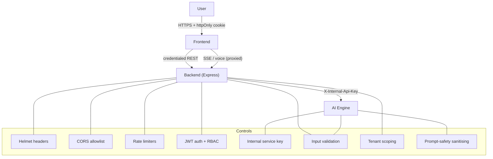

# SECURITY.md — Aegis AI Security Policy & Controls

> The authoritative security reference for Aegis AI: authentication,
> authorization, service isolation, secrets, input validation, tenant
> isolation, OWASP alignment, and the hardening backlog.
>
> Aegis AI handles **sensitive personal, health, and financial data** for
> vulnerable users. Security is a first-class product requirement, not an
> afterthought.
>
> **See also:** [ARCHITECTURE.md §10](ARCHITECTURE.md) ·
> [CLAUDE.md §8](CLAUDE.md) · [DATABASE.md](DATABASE.md) ·
> [API_REFERENCE.md](API_REFERENCE.md)

---

## 1. Security Model at a Glance

**Trust boundaries**
1. Browser ↔ Backend — untrusted client; authenticated by httpOnly-cookie JWT.
2. Backend ↔ AI Engine — trusted server-to-server; authenticated by shared
   internal key.

**The browser never talks to the AI engine.** Every path to it, streaming
included, goes through the backend, which authenticates the customer and tells
the engine who they are. This is not a routing preference: the engine resolves
the `user_name` it is given straight to that customer's profile and conversation
memory, so a browser allowed to address it directly could name any customer and
read and write their data. The engine must not be publicly reachable — the proxy
is the control, and the shared key is what is left if the network is not.

---

## 2. Authentication

- **Mechanism:** JSON Web Token (JWT), signed with `JWT_SECRET`.
- **Delivery:** an **httpOnly** cookie (`aegis_token`) — not readable by
  JavaScript, which neutralises XSS token theft. A `Bearer` header is also
  accepted for non-browser API clients.
- **Cookie flags:** `httpOnly`, `secure` (when `COOKIE_SECURE=true`),
  `sameSite` (`none` with Secure, else `lax`), scoped `path=/`, expiry derived
  from `JWT_EXPIRES_IN`.
- **Session resolution:** the frontend calls `GET /api/auth/me`; it never stores
  the token client-side.
- **Password hashing:** bcrypt at **cost factor 12**. The cost is stored in the
  hash, so older cost-10 hashes still verify.
- **Anti-enumeration:** login always runs a bcrypt comparison — against a dummy
  hash when the email is unknown — so response timing cannot reveal which emails
  are registered.

### Secret strength (fail-fast)
`config/env.js` validates at boot and **refuses to start** on:
- missing `JWT_SECRET`;
- in production, a secret shorter than 32 chars or matching a known-weak pattern
  (`secret`, `changeme`, `password`, …).

---

## 3. Authorization (RBAC)

- **Roles:** `customer`, `admin`, `superadmin`.
- **Enforcement:** `protect` (verifies token + that the user still exists) then
  `restrictTo(...roles)` on privileged routes.
- **No privilege escalation via signup:** public registration **always** creates
  a `customer`; `role` is never read from the request body. Elevated roles are
  granted only by an admin flow or the `promote-admin.js` script.
- **Admin portal gate:** `/admin-login` denies non-admin accounts and tears down
  any session they obtained there.
- **Server is the boundary:** frontend route guards are UX; the real check is the
  backend `restrictTo`. Admin data endpoints return **403** to customers.

| Route class | Guard |
|---|---|
| `/api/auth/register`,`/login` | rate-limited, validated |
| `/api/auth/me` | `protect` |
| `/api/chat`, `/api/ui-action` | `protect` + `aiLimiter` |
| `/api/leads` (list/manage) | `protect` + `restrictTo("admin","superadmin")` |
| `/api/leads/:id` DELETE | `restrictTo("superadmin")` |
| `/api/policies` POST | `restrictTo("admin","superadmin")` |
| `/api/company` POST | `restrictTo("superadmin")` |
| `/api/admin/*` | `restrictTo("admin","superadmin")` |
| `/uploads/*` | `protect` (private customer documents) |

---

## 4. Service Isolation (Backend ↔ AI Engine)

The AI engine performs paid LLM work and must only be callable by the trusted
backend:

- Protected routes require the `X-Internal-Api-Key` header.
- Comparison is **constant-time** (`hmac.compare_digest`).
- **Fail-closed in production:** if the key is unset in prod, protected routes
  return `503` rather than running unauthenticated.
- The backend attaches the key on every AI call from `ai.service.js`.

---

## 5. Transport & HTTP Hardening

Configured via Helmet in `app.js`:

| Control | Setting |
|---|---|
| HSTS | `max-age=31536000; includeSubDomains; preload` |
| Referrer-Policy | `no-referrer` |
| Cross-Origin-Resource-Policy | `same-site` |
| `X-Powered-By` | disabled |
| Body size | JSON / urlencoded capped at `10kb` |

**CORS:** a strict allowlist from `CLIENT_URL` / `ALLOWED_ORIGINS`. A wildcard
origin is **never** combined with `credentials: true`. Socket.io uses the same
allowlist.

**Trust proxy:** `TRUST_PROXY` controls how the client IP is derived for rate
limiting. Default `false`; set to the number of front proxies in production.
Never `true` (that enables IP spoofing).

---

## 6. Rate Limiting & Abuse Control

| Limiter | Window | Max | Scope |
|---|---|---|---|
| `apiLimiter` | 15 min | 100 | all `/api` |
| `authLimiter` | 1 hour | 20 | login/register |
| `aiLimiter` | 1 min | 20 | chat / UI actions (paid LLM) |
| socket throttle | 1 min | 20 | per-connection AI messages |

Rationale: protect credentials from brute force and the **paid LLM path** from
cost-abuse and scraping bursts.

---

## 7. Input Validation

- **Backend:** every mutating endpoint validates its body (`validations/
  schemas.js`) — email format, name length, password length (6–72 bytes; the
  72-byte cap avoids bcrypt truncation and hashing-DoS), numeric premiums, etc.
- **AI engine:** all requests are Pydantic v2 models with **bounded** fields
  (`message ≤ 8000`, `history ≤ 100`, `user_name ≤ 200`, …) to prevent LLM
  cost-abuse and memory-exhaustion DoS.
- **Uploads:** extension **and** MIME must both be on the allowlist (`.pdf`,
  `.docx`, `.png`, `.jpg`, `.heic`, `.webp`, `.mp4`, `.mov`); up to 50 MB and 5
  files per request; stored with generated filenames; served behind `protect`
  with `dotfiles: deny`. Neither the extension nor the declared MIME is trusted:
  every file's **magic bytes are read and must agree with its extension**, so a
  real MP4 named `invoice.pdf` is rejected even though both formats are allowed
  (`src/utils/fileTypes.ts`, `src/utils/fileScan.ts`).
- **Never trust client identity:** `sender`/`name`/`role` from a client are not
  authoritative after authentication; the verified user is used instead. This
  includes `user_name` on AI-engine calls — the backend supplies it from the
  session, and the browser has no way to assert it.

### Values that reach an LLM prompt

Profile fields are rendered into the agent's system prompt, and every one of
them started as something the customer typed. An answer is therefore an input to
the prompt, and is treated as one (`app/utils/prompt_safety.py`).

- **Defend against structure, not vocabulary.** What carries an injection is a
  newline — it lets a value open a block of its own — and length, which turns a
  sentence into a wall. Values are flattened and bounded. A blocklist of phrases
  like "ignore previous instructions" is reworded in a minute; a value that
  cannot leave its line has nowhere to say it.
- **Every field that reaches a prompt is length-capped.** Named fields have a
  ceiling sized to a real answer; anything unlisted still gets a default. An
  unlisted field is an oversight, not a licence.
- **Removed:** control characters, zero-width and bidi overrides (invisible to
  the customer and to a reviewer, not to the model), and angle brackets, so a
  value cannot forge the block it is rendered inside.
- **Never an alphabetic allow-list.** Our customers write their names in Tamil
  and answer in Tamil, English, and a mix of both; an `[A-Za-z]` filter would
  corrupt exactly the people this product exists for. Unicode letters pass
  through untouched.
- **Sanitise at both ends** — when a value is extracted, so nothing new is
  stored raw, and again when a profile is rendered, because profiles written
  before a rule existed are still on disk and still load. Securing only the
  write leaves every existing profile live.
- **Customer data in a prompt is fenced and framed** as data, not instructions,
  in the renderer rather than in each agent's `SYSTEM_PROMPT` — so no agent can
  be added without it.

---

## 8. Tenant Isolation

Cross-tenant data leakage is treated as a **critical** defect.

- Every query returning user data is scoped by `userId`
  (e.g. `chat.findMany({ where: { userId } })`).
- AI conversation history sent to the model is scoped to the authenticated user —
  one customer's context can never enter another's prompt.
- AI-engine memory is namespaced per customer and per domain
  (`{domain}_{customer_id}`).

---

## 9. Secrets & Environment Management

- Real secrets live only in **gitignored** `.env` files; `.env.example`
  templates carry placeholders.
- `.env`, `dev.db`, DB backups, `node_modules`, `venv` are all gitignored and
  verified before every commit (`git check-ignore`).
- **Any exposed secret is rotated immediately** (revoke at the provider; note
  that removing it from a file does not remove it from git history).
- Sensitive config is read through validated modules (`config/env.js`,
  `app/config/config.py`), never `process.env` scattered across the code.

### Runtime data is not source

Secrets are not the only thing that must never be committed. The AI engine
writes a profile, a conversation state, a risk score and a recommendation cache
entry **per customer** into `Aegis-AI/layer3/` as it runs. In production each of
those describes a real person: their name, age, income, medical history, and
what they told an advisor.

- **The four runtime stores are gitignored**, with the demo personas
  allow-listed by name. A customer who is not a demo persona is never offered to
  git — a directory the engine writes to is one `git add -A` from committing
  real customer data.
- **Nothing there is a required fixture.** The engine creates each file on
  demand when it is missing; the suite passes with the profiles emptied. A file
  that must exist for tests to pass would be a reason to fix the tests, not to
  commit customer data.
- **Demo personas carry sample data only.** `customer_id` is structural — the
  engine derives it from the account name and looks the file up by it — so a
  file named after a real account cannot be anonymised by editing it. Those are
  untracked instead.
- **Removing a file does not remove it from history.** Same rule as a leaked
  secret: if real data was committed, the file's deletion is not the fix.

| Variable | Component | Notes |
|---|---|---|
| `JWT_SECRET` | backend | ≥32 chars, high-entropy; fail-fast |
| `AI_INTERNAL_API_KEY` | backend + AI | must match on both sides |
| `DEFAULT_PROVIDER` / `OLLAMA_*` / `GEMINI_API_KEY` / `OPENAI_API_KEY` | AI | provider selection |
| `COOKIE_SECURE`, `CLIENT_URL`, `TRUST_PROXY` | backend | transport/CORS/proxy |

---

## 10. Error Handling & Information Disclosure

- **Production:** clients receive generic messages; stack traces and internal
  exception detail are logged **server-side only** (backend `error.middleware`,
  AI engine returns "Internal server error." and logs with `exc_info`).
- **Health endpoints** are minimal and do **not** disclose which LLM providers
  or keys are configured.
- Prisma errors are mapped to safe, user-facing messages.
- **Never relay an upstream's error detail.** A failed call to the AI engine
  carries its host and port in the client library's message, and the engine's
  own errors describe its internals — it takes care not to leak them, and
  passing them on undoes that. Log the detail; return a generic message. A 4xx
  may keep its status, since the caller's payload being wrong is worth telling
  them: the status says which, without the message saying how we are built.

---

## 11. Client-Side Data

Anything in the browser belongs to whoever is sitting at it. Our customers are
disproportionately on a shared, borrowed, or public machine — that is not an
edge case here, it is the audience in [CLAUDE.md §1](CLAUDE.md).

- **KYC identifiers never touch disk.** PAN and Aadhaar are held in memory for
  the length of the purchase flow and redacted before anything is persisted.
  `localStorage` is readable by any script on the origin and outlives the
  session, so a persisted identifier waits there for the next person. A refresh
  mid-purchase costing the customer re-entry is the accepted trade.
- **Logging out purges the device.** One function
  (`lib/session-cleanup.ts`) decides what leaving removes: the purchase in
  progress, every advisor transcript, and the session id — which would otherwise
  let the next person resume the conversation server-side. It runs even when the
  logout request fails; especially then, since the local copy is all that is
  left. The theme preference is deliberately spared: it says nothing about the
  customer.
- **That function is the list.** Anything new that stores customer data in the
  browser belongs in it. One place to audit, one place to extend.
- **Transcripts are customer data.** An advisor conversation names conditions,
  income, and family. It is not "just UI state" because it lives in the UI.
- **No secrets in the client bundle.** Only `NEXT_PUBLIC_*` values reach the
  browser, and only URLs go in them. A constant pointing at an internal service
  is not neutral — it is an invitation to bypass whatever fronts it.

---

## 12. OWASP Top-10 Alignment

| Risk | Status | Control |
|---|---|---|
| A01 Broken Access Control | ✅ | RBAC + tenant scoping; uploads scoped by `ownerId`; the AI engine is reachable only via the authenticated backend |
| A02 Cryptographic Failures | ✅ | bcrypt-12, httpOnly+Secure cookies, HSTS |
| A03 Injection | ✅ | Prisma parameterisation; validated/bounded input; profile values flattened and bounded before reaching a prompt (§7) |
| A04 Insecure Design | ✅ | agent isolation, consent transfers, fail-closed key; KYC identifiers never persisted client-side (§11) |
| A05 Security Misconfiguration | ✅ | Helmet, strict CORS, fail-fast env validation |
| A06 Vulnerable Components | ⚠️ | keep deps patched (backlog: automated scanning) |
| A07 Auth Failures | ✅ | rate limits, anti-enumeration, strong hashing |
| A08 Integrity Failures | ⚠️ | signed artifacts / SRI (future) |
| A09 Logging & Monitoring | ⚠️ | structured logs; centralised monitoring (future) |
| A10 SSRF | ✅ | AI engine calls fixed provider URLs only |

---

## 13. Hardening Backlog (tracked)

| Item | Severity | Plan |
|---|---|---|
| CSRF for cookie auth with `SameSite=None` | Medium | Add CSRF token / double-submit for state-changing routes |
| JWT also returned in response body (redundant) | Low | Remove after frontend audit confirms cookie-only |
| Dependency & secret scanning in CI | Medium | Add automated scans + Dependabot-style updates |
| Centralised security logging/alerting | Medium | Ship logs to a SIEM; alert on auth anomalies |

---

## 14. Incident Response (baseline)

1. **Contain** — revoke exposed keys, invalidate sessions (rotate `JWT_SECRET`),
   block abusive IPs.
2. **Assess** — scope the data/accounts affected; preserve logs.
3. **Remediate** — patch the root cause; add a regression test.
4. **Communicate** — notify affected users per policy/regulation.
5. **Learn** — post-mortem; update this document and controls.

> Reminder: rotating a secret at the provider is the real fix — deleting it from
> a file leaves it in git history.

---

## 15. Reporting a Vulnerability

Report suspected vulnerabilities privately to the project owner. Do not open a
public issue with exploit detail. Include reproduction steps, impact, and
affected components.
