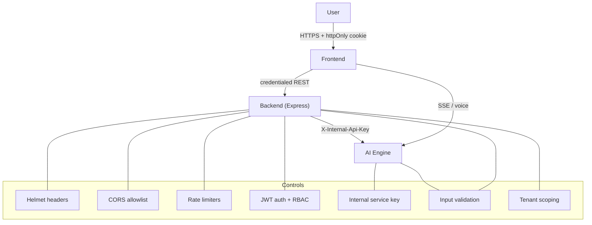

# SECURITY.md — Aegis AI Security Policy & Controls

> The authoritative security reference for Aegis AI: authentication,
> authorization, service isolation, secrets, input validation, tenant
> isolation, OWASP alignment, and the hardening backlog.
>
> Aegis AI handles **sensitive personal, health, and financial data** for
> vulnerable users. Security is a first-class product requirement, not an
> afterthought.
>
> **See also:** [ARCHITECTURE.md §10](ARCHITECTURE.md) ·
> [CLAUDE.md §8](CLAUDE.md) · [DATABASE.md](DATABASE.md) ·
> [API_REFERENCE.md](API_REFERENCE.md)

---

## 1. Security Model at a Glance

**Trust boundaries**
1. Browser ↔ Backend — untrusted client; authenticated by httpOnly-cookie JWT.
2. Backend ↔ AI Engine — trusted server-to-server; authenticated by shared
   internal key.
3. Browser ↔ AI Engine (SSE) — the streaming/voice path; hardening backlog item
   (§12).

---

## 2. Authentication

- **Mechanism:** JSON Web Token (JWT), signed with `JWT_SECRET`.
- **Delivery:** an **httpOnly** cookie (`aegis_token`) — not readable by
  JavaScript, which neutralises XSS token theft. A `Bearer` header is also
  accepted for non-browser API clients.
- **Cookie flags:** `httpOnly`, `secure` (when `COOKIE_SECURE=true`),
  `sameSite` (`none` with Secure, else `lax`), scoped `path=/`, expiry derived
  from `JWT_EXPIRES_IN`.
- **Session resolution:** the frontend calls `GET /api/auth/me`; it never stores
  the token client-side.
- **Password hashing:** bcrypt at **cost factor 12**. The cost is stored in the
  hash, so older cost-10 hashes still verify.
- **Anti-enumeration:** login always runs a bcrypt comparison — against a dummy
  hash when the email is unknown — so response timing cannot reveal which emails
  are registered.

### Secret strength (fail-fast)
`config/env.js` validates at boot and **refuses to start** on:
- missing `JWT_SECRET`;
- in production, a secret shorter than 32 chars or matching a known-weak pattern
  (`secret`, `changeme`, `password`, …).

---

## 3. Authorization (RBAC)

- **Roles:** `customer`, `admin`, `superadmin`.
- **Enforcement:** `protect` (verifies token + that the user still exists) then
  `restrictTo(...roles)` on privileged routes.
- **No privilege escalation via signup:** public registration **always** creates
  a `customer`; `role` is never read from the request body. Elevated roles are
  granted only by an admin flow or the `promote-admin.js` script.
- **Admin portal gate:** `/admin-login` denies non-admin accounts and tears down
  any session they obtained there.
- **Server is the boundary:** frontend route guards are UX; the real check is the
  backend `restrictTo`. Admin data endpoints return **403** to customers.

| Route class | Guard |
|---|---|
| `/api/auth/register`,`/login` | rate-limited, validated |
| `/api/auth/me` | `protect` |
| `/api/chat`, `/api/ui-action` | `protect` + `aiLimiter` |
| `/api/leads` (list/manage) | `protect` + `restrictTo("admin","superadmin")` |
| `/api/leads/:id` DELETE | `restrictTo("superadmin")` |
| `/api/policies` POST | `restrictTo("admin","superadmin")` |
| `/api/company` POST | `restrictTo("superadmin")` |
| `/api/admin/*` | `restrictTo("admin","superadmin")` |
| `/uploads/*` | `protect` (private customer documents) |

---

## 4. Service Isolation (Backend ↔ AI Engine)

The AI engine performs paid LLM work and must only be callable by the trusted
backend:

- Protected routes require the `X-Internal-Api-Key` header.
- Comparison is **constant-time** (`hmac.compare_digest`).
- **Fail-closed in production:** if the key is unset in prod, protected routes
  return `503` rather than running unauthenticated.
- The backend attaches the key on every AI call from `ai.service.js`.

---

## 5. Transport & HTTP Hardening

Configured via Helmet in `app.js`:

| Control | Setting |
|---|---|
| HSTS | `max-age=31536000; includeSubDomains; preload` |
| Referrer-Policy | `no-referrer` |
| Cross-Origin-Resource-Policy | `same-site` |
| `X-Powered-By` | disabled |
| Body size | JSON / urlencoded capped at `10kb` |

**CORS:** a strict allowlist from `CLIENT_URL` / `ALLOWED_ORIGINS`. A wildcard
origin is **never** combined with `credentials: true`. Socket.io uses the same
allowlist.

**Trust proxy:** `TRUST_PROXY` controls how the client IP is derived for rate
limiting. Default `false`; set to the number of front proxies in production.
Never `true` (that enables IP spoofing).

---

## 6. Rate Limiting & Abuse Control

| Limiter | Window | Max | Scope |
|---|---|---|---|
| `apiLimiter` | 15 min | 100 | all `/api` |
| `authLimiter` | 1 hour | 20 | login/register |
| `aiLimiter` | 1 min | 20 | chat / UI actions (paid LLM) |
| socket throttle | 1 min | 20 | per-connection AI messages |

Rationale: protect credentials from brute force and the **paid LLM path** from
cost-abuse and scraping bursts.

---

## 7. Input Validation

- **Backend:** every mutating endpoint validates its body (`validations/
  schemas.js`) — email format, name length, password length (6–72 bytes; the
  72-byte cap avoids bcrypt truncation and hashing-DoS), numeric premiums, etc.
- **AI engine:** all requests are Pydantic v2 models with **bounded** fields
  (`message ≤ 8000`, `history ≤ 100`, `user_name ≤ 200`, …) to prevent LLM
  cost-abuse and memory-exhaustion DoS.
- **Uploads:** extension **and** MIME must both be on the allowlist (`.pdf`,
  `.docx`); single-file, 10 MB cap; stored with generated filenames;
  served behind `protect` with `dotfiles: deny`.
- **Never trust client identity:** `sender`/`name`/`role` from a client are not
  authoritative after authentication; the verified user is used instead.

---

## 8. Tenant Isolation

Cross-tenant data leakage is treated as a **critical** defect.

- Every query returning user data is scoped by `userId`
  (e.g. `chat.findMany({ where: { userId } })`).
- AI conversation history sent to the model is scoped to the authenticated user —
  one customer's context can never enter another's prompt.
- AI-engine memory is namespaced per customer and per domain
  (`{domain}_{customer_id}`).

---

## 9. Secrets & Environment Management

- Real secrets live only in **gitignored** `.env` files; `.env.example`
  templates carry placeholders.
- `.env`, `dev.db`, DB backups, `node_modules`, `venv` are all gitignored and
  verified before every commit (`git check-ignore`).
- **Any exposed secret is rotated immediately** (revoke at the provider; note
  that removing it from a file does not remove it from git history).
- Sensitive config is read through validated modules (`config/env.js`,
  `app/config/config.py`), never `process.env` scattered across the code.

| Variable | Component | Notes |
|---|---|---|
| `JWT_SECRET` | backend | ≥32 chars, high-entropy; fail-fast |
| `AI_INTERNAL_API_KEY` | backend + AI | must match on both sides |
| `DEFAULT_PROVIDER` / `OLLAMA_*` / `GEMINI_API_KEY` / `OPENAI_API_KEY` | AI | provider selection |
| `COOKIE_SECURE`, `CLIENT_URL`, `TRUST_PROXY` | backend | transport/CORS/proxy |

---

## 10. Error Handling & Information Disclosure

- **Production:** clients receive generic messages; stack traces and internal
  exception detail are logged **server-side only** (backend `error.middleware`,
  AI engine returns "Internal server error." and logs with `exc_info`).
- **Health endpoints** are minimal and do **not** disclose which LLM providers
  or keys are configured.
- Prisma errors are mapped to safe, user-facing messages.

---

## 11. OWASP Top-10 Alignment

| Risk | Status | Control |
|---|---|---|
| A01 Broken Access Control | ✅ / backlog | RBAC + tenant scoping; **upload IDOR** pending (§12) |
| A02 Cryptographic Failures | ✅ | bcrypt-12, httpOnly+Secure cookies, HSTS |
| A03 Injection | ✅ | Prisma parameterisation; validated/bounded input |
| A04 Insecure Design | ✅ | agent isolation, consent transfers, fail-closed key |
| A05 Security Misconfiguration | ✅ | Helmet, strict CORS, fail-fast env validation |
| A06 Vulnerable Components | ⚠️ | keep deps patched (backlog: automated scanning) |
| A07 Auth Failures | ✅ | rate limits, anti-enumeration, strong hashing |
| A08 Integrity Failures | ⚠️ | signed artifacts / SRI (future) |
| A09 Logging & Monitoring | ⚠️ | structured logs; centralised monitoring (future) |
| A10 SSRF | ✅ | AI engine calls fixed provider URLs only |

---

## 12. Hardening Backlog (tracked)

| Item | Severity | Plan |
|---|---|---|
| SSE stream endpoint is browser-reachable without the internal key | High | Front with an API gateway or proxy through the backend without breaking voice |
| Upload IDOR — documents not scoped to an owner | Medium | Add `ownerId` to `UploadedDocument` + scope queries (DATABASE phase) |
| CSRF for cookie auth with `SameSite=None` | Medium | Add CSRF token / double-submit for state-changing routes |
| JWT also returned in response body (redundant) | Low | Remove after frontend audit confirms cookie-only |
| Dependency & secret scanning in CI | Medium | Add automated scans + Dependabot-style updates |
| Centralised security logging/alerting | Medium | Ship logs to a SIEM; alert on auth anomalies |

---

## 13. Incident Response (baseline)

1. **Contain** — revoke exposed keys, invalidate sessions (rotate `JWT_SECRET`),
   block abusive IPs.
2. **Assess** — scope the data/accounts affected; preserve logs.
3. **Remediate** — patch the root cause; add a regression test.
4. **Communicate** — notify affected users per policy/regulation.
5. **Learn** — post-mortem; update this document and controls.

> Reminder: rotating a secret at the provider is the real fix — deleting it from
> a file leaves it in git history.

---

## 14. Reporting a Vulnerability

Report suspected vulnerabilities privately to the project owner. Do not open a
public issue with exploit detail. Include reproduction steps, impact, and
affected components.
